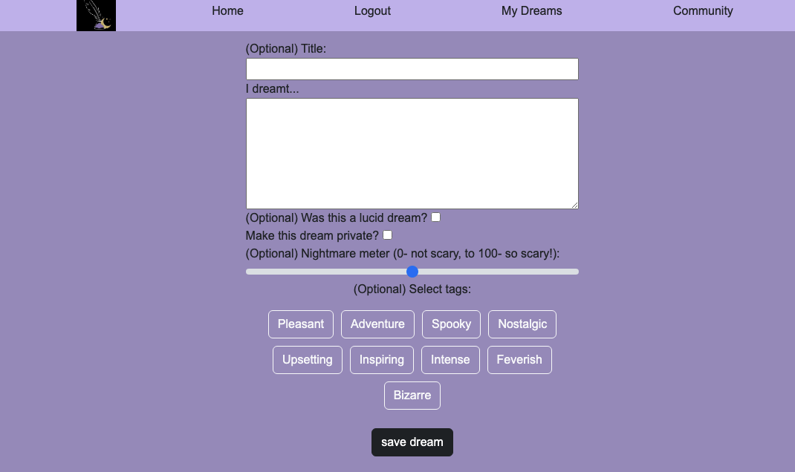

# Dream Journal

## Description

Record your dreams daily and access a log of your dreams to notice patterns and become more in touch with your subconcious. Connect with other dreamers by visiting the Community page.

## Table of Contents

- [Installation](#installation)
- [Usage](#usage)
- [License](#license)
- [Contributing](#contributing)
- [Tests](#tests)
- [Questions](#questions)
- [Credits](#credits)

## Installation

Visit the deployed Heroku page to create an account and start posting dreams!

## Usage

Use the new dream button to enter a dream with as much or little detail as you like, visit My Dreams to see your saved dreams, and check out the Community page to see what other users have been dreaming.

## License

Dream Journal is covered under the MIT License, as outlined at the [MIT License page on ChooseALicense](https://choosealicense.com/licenses/mit/)

## Contributing

Contributor Covenant, as described at [the Contributor Covenant website](https://www.contributor-covenant.org/)

## Tests

See screenshots below:

## Credits

The project brought to you by MinhThu, Jensen, Minga and Brian with some periodic help from instructional staff with the Northwestern Coding Bootcamp.

--
        